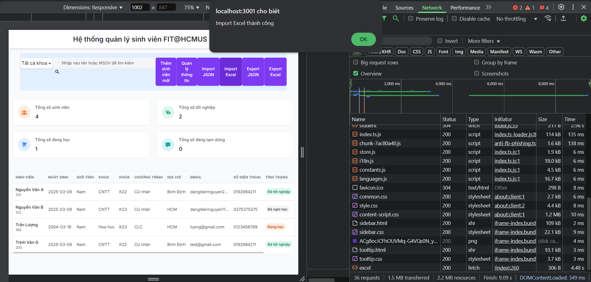
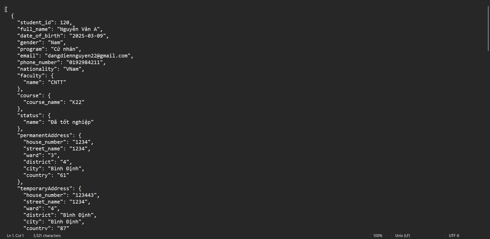
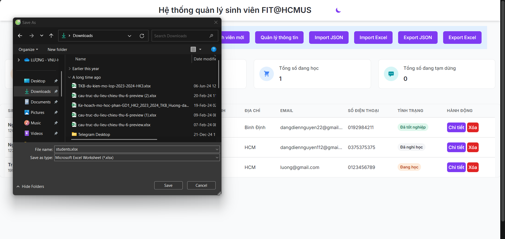
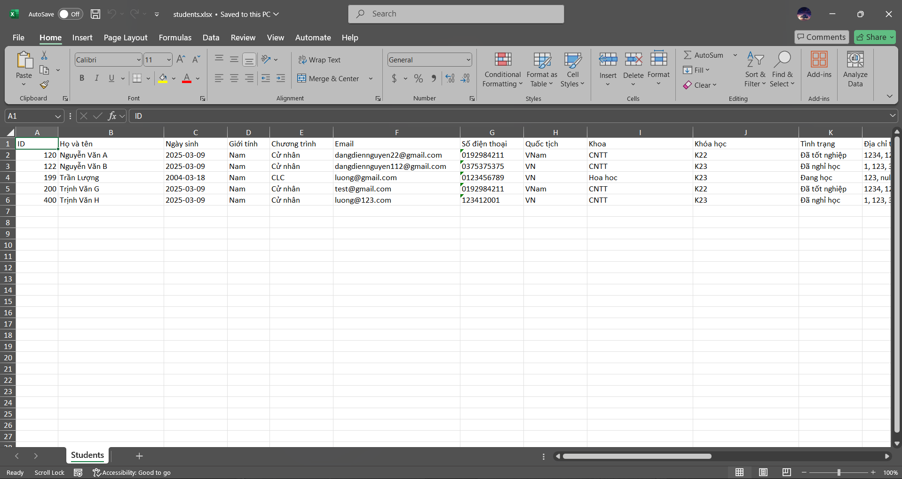

# Student Management Program Version 2.0


## 1. Implementation Technologies  

We will use the following technologies:  

- **Frontend**: HTML, CSS, JavaScript, Tailwind  
- **Backend**: Node.js, Express, TypeScript
- **Database**: PostgreSQL with Sequelize ORM  

## 2. Project Structure  

Student_Management/
├── .env                 # Environment variables configuration  
├── .gitignore           # Git ignore file  
├── package.json         # Project dependencies and scripts  
├── public/              # Static assets for the frontend  
│   ├── assets/          # CSS, JavaScript, and other static files  
│   │   ├── css/         # CSS files  
│   │   ├── js/          # JavaScript files  
│   │   └── scripts/     # Additional JavaScript scripts  
│   ├── add.html         # Add student page  
│   ├── detail.html      # Student detail page  
│   ├── index.html       # Main frontend file  
│   └── more.html        # Additional information page  
├── src/                 # Backend source code  
│   ├── config/          # Database configuration  
│   ├── controllers/     # Handles business logic for students  
│   ├── models/          # Database models (Student, Faculty, etc.)  
│   ├── routes/          # API route definitions  
│   ├── services/        # Service layer for handling data operations  
│   └── index.ts         # Entry point for the backend  
├── tsconfig.json        # TypeScript configuration  
├── vercel.json          # Deployment configuration for Vercel  
└── README.md            # Project documentation  

## 3. Installation & Running the Application  

### 3.1. Install Dependencies  
Ensure you have **Node.js** installed. Then, install the required packages:  
```sh
npm install
```
### 3.2. Configure Environment Variables
Add .env file in txt file

PORT=
DB_NAME=
DB_USER=
DB_PASSWORD=
DB_HOST=
DB_PORT=
DB_DIALECT=

### 3.3. Build & Run the Application

```sh
npm start
```

## 4. Deploying
```sh
https://student-management-oary.vercel.app/
```
## 5. Screenshots









